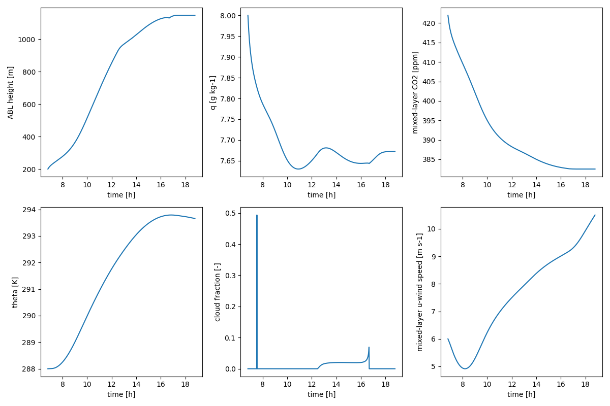

.. abc-model documentation master file, created by
   sphinx-quickstart on Fri Oct 17 16:03:49 2025.
   You can adapt this file completely to your liking, but it should at least
   contain the root `toctree` directive.
.. Add your content using ``reStructuredText`` syntax. See the
   `reStructuredText <https://www.sphinx-doc.org/en/master/usage/restructuredtext/index.html>`_
   documentation for details.

ABC Model
=========

The ABC Model is a simple model coupling the biosphere and atmos,
made fully differentiable using `JAX`_ highly inspired by the `CLASS model`_
with the goal to serve as a simple tool for experiments.

.. _JAX: https://docs.jax.dev/en/latest/index.html
.. _CLASS model: https://classmodel.github.io

This documentation provides installation instructions, a complete tutorial,
and a detailed API reference for all model components.

Installation
------------

Install directly from the repository with ``pip``:

.. code-block:: bash

   pip install git+https://git.bgc-jena.mpg.de/abc3/abc-model

Or for development, clone the repository and perform an editable install:

.. code-block:: bash

   git clone https://git.bgc-jena.mpg.de/abc3/abc-model.git
   cd abc-model
   pip install -e .

Quick Example
-------------

To set up the coupler, we will use 5 components:

1. Radiation model
2. Land surface model
3. Surface layer model
4. Mixed layer model
5. Cloud model

We provide an example configuration taken from the CLASS model, which can be
loaded through the ``abcconfigs`` module.

.. code-block:: python

   import abcconfigs.class_model as cm
   import abcmodel

   # 1. Setup models
   rad_model = abcmodel.rad.StandardRadiationModel(**cm.standard_rad.model_kwargs)
   land_model = abcmodel.land.JarvisStewartModel(**cm.jarvis_stewart.model_kwargs)
   surface_layer_model = abcmodel.atmos.surface_layer.ObukhovSurfaceLayerModel()
   mixed_layer_model = abcmodel.atmos.mixed_layer.BulkMixedLayerModel(**cm.bulk_mixed_layer.model_kwargs)
   cloud_model = abcmodel.atmos.clouds.CumulusModel()

   # 2. Setup atmos model
   atmos_model = abcmodel.atmos.DayOnlyAtmosphereModel(
       surface_layer=surface_layer_model,
       mixed_layer=mixed_layer_model,
       clouds=cloud_model,
   )

   # 3. Setup the coupler with the components
   abcoupler = abcmodel.ABCoupler(
       rad=rad_model,
       land=land_model,
       atmos=atmos_model,
   )

   # 4. Setup initial conditions for each model
   rad_state = rad_model.init_state(**cm.standard_rad.state_kwargs)
   land_state = land_model.init_state(**cm.jarvis_stewart.state_kwargs)
   surface_layer_state = surface_layer_model.init_state(**cm.obukhov_surface_layer.state_kwargs)
   mixed_layer_state = mixed_layer_model.init_state(**cm.bulk_mixed_layer.state_kwargs)
   cloud_state = cloud_model.init_state()

   # 5. Setup atmos state
   atmos_state = atmos_model.init_state(
       surface=surface_layer_state,
       mixed=mixed_layer_state,
       clouds=cloud_state,
   )

   # 6. Bind everything into a single initial state
   state = abcoupler.init_state(
       rad_state,
       land_state,
       atmos_state,
   )

   # 7. Integrate the model
   time, trajectory = abcmodel.integrate(
       state, abcoupler, dt=60.0, runtime=12 * 3600.0
   )

Plotting the results should give us the following figure:

Changing Models and Parameters
------------------------------

You can easily swap out models or change their parameters. For example, to
replace the ``JarvisStewartModel`` with ``AgsModel`` and change it from
C3 to C4 vegetation, you can do the following:

.. code-block:: python

   # New parameters definition
   ags_model_kwargs = cm.ags.model_kwargs
   ags_model_kwargs['c3c4'] = 'c4'

   # Define a new land model
   land_model = abcmodel.land.AgsModel(**ags_model_kwargs)

   # ... then redefine the coupler, create a new state, and integrate.

Performance Notes
-----------------
It is also possible to JIT the model using ``equinox.filter_jit(integrate)``.
While this does not currently benefit a single analysis run, it becomes
important for accelerating training loops during parameter calibration.

Detailed API Reference
----------------------

For a detailed description of each model and its functions, see the API section.

.. toctree::
   :hidden:

   ABC Model <source/api/abcmodel>
   ABC Configs <source/api/abcconfigs>
